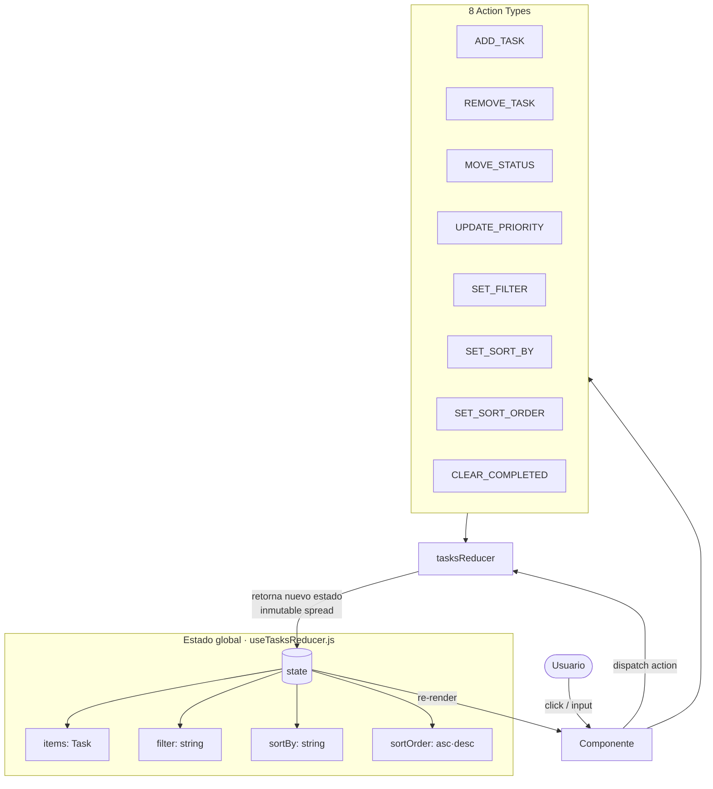
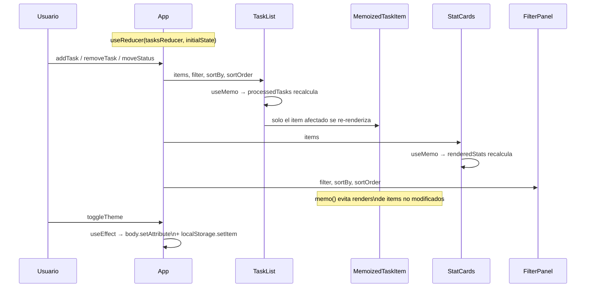
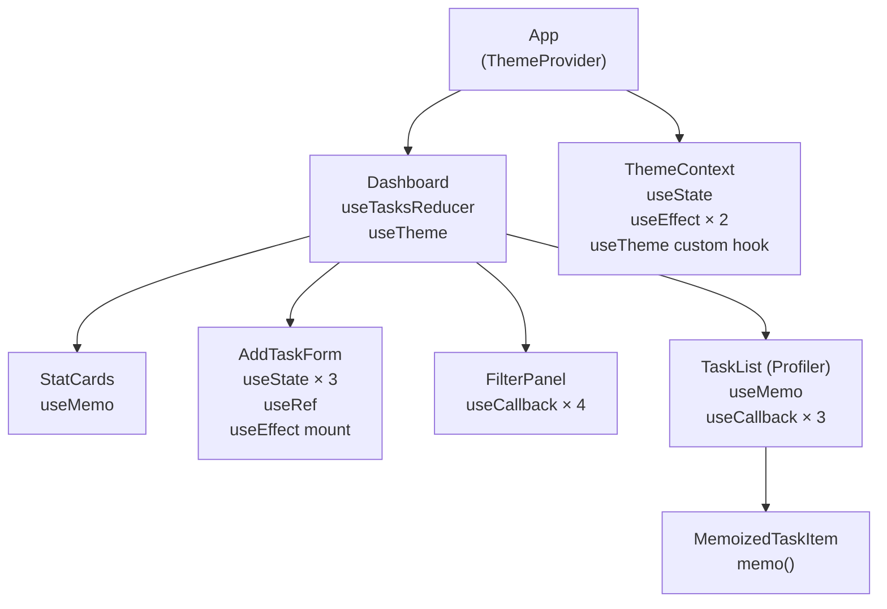

# Dev Task Board — Práctica Semana 07

Dashboard de Gestión de Tareas Dev construido con React Hooks.  
Asignatura: Desarrollo de Aplicaciones Web (IS093A) · Unidad I: Frontend.

---

## Instalación

```bash
git clone https://github.com/AnnaOlenka/repo_practica07_grupal.git
cd repo_practica07_grupal
npm install
npm run dev
```

Abrir `http://localhost:5173` en el navegador.

---

## Diagrama de flujo de estado y ciclo de render

### Flujo principal — useReducer



---

### Ciclo de render por componente



---

### Árbol de componentes y hooks



---

## Justificación técnica de cada hook

### `useReducer` — `src/hooks/useTasksReducer.js`

**¿Por qué no useState simple?**

El estado contiene cuatro sub-valores relacionados (`items`, `filter`, `sortBy`, `sortOrder`). Con `useState` independiente se necesitarían cuatro setters y la lógica de transición estaría dispersa en cada componente. Además, acciones como `ADD_TASK` dependen del estado anterior (`[...state.items, nuevo]`) y requieren inmutabilidad estricta, lo que `useReducer` fuerza por diseño.

```js
// Reducer puro — cero mutaciones directas
case ACTIONS.ADD_TASK:
  return { ...state, items: [...state.items, { id: Date.now(), ...payload }] }

case ACTIONS.MOVE_STATUS:
  return {
    ...state,
    items: state.items.map(item =>
      item.id === payload.id ? { ...item, status: payload.status } : item
    )
  }
```

Las acciones son constantes exportadas (`ACTIONS`). Los action creators se agrupan en `buildActions(dispatch)` y se memorizan con `useMemo(() => buildActions(dispatch), [dispatch])` para que su referencia sea estable.

---

### `useState` — `src/components/AddTaskForm.jsx` y `src/contexts/ThemeContext.jsx`

**¿Por qué useState aquí y no useReducer?**

En `AddTaskForm` el estado (`title`, `category`, `priority`) es local al formulario, sin lógica compleja de transición ni necesidad de compartirse. `useState` es suficiente. En `ThemeContext` hay un único valor (`theme`) con una sola transición, por lo que agregar un reducer sería sobreingeniería.

```js
// ThemeContext — lazy initializer para evitar re-render inicial
const [theme, setTheme] = useState(() => {
  const saved = localStorage.getItem('theme')
  if (saved) return saved
  return window.matchMedia('(prefers-color-scheme: light)').matches ? 'light' : 'dark'
})
```

El lazy initializer (`() => ...`) garantiza que `localStorage` se lee solo una vez al montar, no en cada render.

---

### `useContext` / `useTheme` — `src/contexts/ThemeContext.jsx` y `src/App.jsx`

**¿Por qué no prop drilling?**

`theme` y `toggleTheme` se necesitan en `Dashboard` (para la clase CSS raíz) y en el `header` (para el botón de toggle). Sin contexto habría que pasar props a través de múltiples niveles. `useContext` los hace disponibles directamente.

Se encapsuló en un custom hook `useTheme()` que lanza un error descriptivo si se usa fuera del `<ThemeProvider>`:

```js
export const useTheme = () => {
  const ctx = useContext(ThemeContext)
  if (!ctx) throw new Error('useTheme debe usarse dentro de <ThemeProvider>')
  return ctx
}
```

---

### `useEffect` — `src/contexts/ThemeContext.jsx` y `src/components/AddTaskForm.jsx`

**Efecto 1 — Sincronizar tema con DOM y localStorage**

```js
useEffect(() => {
  document.body.setAttribute('data-theme', theme)
  localStorage.setItem('theme', theme)
}, [theme]) // solo se ejecuta cuando theme cambia
```

La dependencia `[theme]` evita ejecuciones innecesarias. No hay cleanup porque no registra suscripciones ni crea recursos asíncronos.

**Efecto 2 — Sincronización entre pestañas (cross-tab)**

```js
useEffect(() => {
  const handleStorage = (e) => {
    if (e.key === 'theme' && e.newValue) setTheme(e.newValue)
  }
  window.addEventListener('storage', handleStorage)
  return () => window.removeEventListener('storage', handleStorage) // cleanup
}, []) // [] → se registra al montar, se limpia al desmontar
```

El `return` de cleanup evita memory leaks: si el `ThemeProvider` se desmonta, el listener se elimina. El array vacío garantiza que solo se registra una vez.

**Efecto 3 — Auto-focus al montar el formulario**

```js
// AddTaskForm.jsx
useEffect(() => {
  inputRef.current?.focus()
}, []) // ejecuta una sola vez al montar el componente
```

---

### `useMemo` — `src/components/TaskList.jsx` y `src/components/StatCards.jsx`

**¿Por qué no calcular en cada render?**

`processedTasks` aplica filtro y ordenamiento sobre toda la lista. Sin `useMemo`, este cálculo se repetiría en cada render aunque solo cambie el tema o algún prop no relacionado.

```js
// TaskList.jsx
const processedTasks = useMemo(() => {
  let result = [...items] // copia inmutable
  if (filter !== 'all') {
    result = result.filter(t => isStatus ? t.status === filter : t.priority === filter)
  }
  result.sort((a, b) => { /* comparación por campo */ })
  return result
}, [items, filter, sortBy, sortOrder])
```

```js
// StatCards.jsx — evita recalcular los 4 contadores en cada render
const renderedStats = useMemo(
  () => STATS.map(stat => ({ ...stat, value: stat.getValue(items) })),
  [items]
)
```

```js
// useTasksReducer.js — estabiliza el objeto actions entre renders
const actions = useMemo(() => buildActions(dispatch), [dispatch])
```

---

### `useCallback` — `src/components/TaskList.jsx` y `src/components/FilterPanel.jsx`

**¿Por qué no funciones inline?**

Las funciones inline crean una nueva referencia en cada render. Al pasarlas como props a `MemoizedTaskItem` (envuelto en `memo()`), una nueva referencia rompe la memoización y fuerza re-renders innecesarios. `useCallback` mantiene la referencia estable mientras no cambien las dependencias.

```js
// TaskList.jsx
const handleRemove         = useCallback((id) => actions.removeTask(id), [actions])
const handleMoveStatus     = useCallback((id, status) => actions.moveStatus(id, status), [actions])
const handleUpdatePriority = useCallback((id, priority) => actions.updatePriority(id, priority), [actions])

// FilterPanel.jsx
const handleFilter   = useCallback((value) => actions.setFilter(value), [actions])
const handleSortBy   = useCallback((value) => actions.setSortBy(value), [actions])
const toggleOrder    = useCallback(() => actions.setSortOrder(sortOrder === 'asc' ? 'desc' : 'asc'), [actions, sortOrder])
const clearCompleted = useCallback(() => actions.clearCompleted(), [actions])
```

---

### `useRef` — `src/components/AddTaskForm.jsx`

**¿Por qué no estado?**

`useRef` persiste la referencia al nodo DOM entre renders **sin disparar un re-render** cuando se modifica. Si se almacenara como `useState`, cada asignación provocaría un ciclo de render innecesario.

Usos concretos:
- Al montar el componente (`useEffect([], [])`) → auto-focus inicial
- Al enviar el formulario → vuelve el foco al input para permitir agregar tareas en serie sin usar el mouse

```js
const inputRef = useRef(null)

// Al montar
useEffect(() => { inputRef.current?.focus() }, [])

// Tras submit
onAdd(trimmed, category, priority)
setTitle('')
inputRef.current?.focus()

// En JSX
<input ref={inputRef} placeholder="Nueva tarea..." />
```

---

### `memo()` y `Profiler` — `src/components/TaskList.jsx` y `src/App.jsx`

`TaskItem` se envuelve en `memo()` para que React omita su re-render si sus props no cambian. Esto es efectivo gracias a los `useCallback` en los handlers: referencia estable de props = sin render extra.

```js
const MemoizedTaskItem = memo(TaskItem)
```

`Profiler` envuelve `<TaskList>` en App.jsx y registra en consola el tiempo real de cada commit:

```js
<Profiler
  id="TaskList"
  onRender={(id, phase, actualDuration) =>
    console.debug(`[Profiler:${id}] ${phase} took ${actualDuration.toFixed(1)}ms`)
  }
>
  <TaskList ... />
</Profiler>
```

---

## React DevTools Profiler

### Cómo grabar

1. Instalar la extensión **React Developer Tools** en Chrome/Firefox.
2. Abrir DevTools → pestaña **Profiler**.
3. Hacer clic en ⏺ **Record**, interactuar con la app (agregar, filtrar, cambiar prioridad), detener la grabación.

### Qué analizar

| Métrica | Dónde verla | Qué indica |
|---|---|---|
| **Commit duration** | Barra superior del flamegraph | Tiempo total de render por interacción |
| **Render reason** | Hover sobre un componente | Props changed / State changed / Hooks changed |
| **Componentes grises** | Flamegraph | No se re-renderizaron (memo efectivo) |
| **Why did this render?** | Panel derecho al seleccionar componente | Razón exacta del re-render |

### Resultados esperados tras optimizaciones

Después de aplicar `memo()` + `useCallback`, al cambiar la prioridad de **un** item:

- `MemoizedTaskItem` del item afectado → **re-render** (props cambiaron)
- `MemoizedTaskItem` de los demás items → **sin render** (props estables)
- `StatCards` → **sin render** (items no cambió en longitud, solo en prioridad)

> **Capturas del Profiler:** _(agregar screenshots aquí tras grabar una sesión)_

---

## Estructura del proyecto

```
src/
├── App.jsx                    # Raíz: ThemeProvider + Dashboard + Profiler
├── index.css                  # Variables CSS (dark/light theme via data-theme)
├── main.jsx
├── contexts/
│   └── ThemeContext.jsx        # createContext, useState, useEffect ×2, useTheme hook
├── hooks/
│   └── useTasksReducer.js     # useReducer, 8 action types, reducer inmutable, useMemo actions
└── components/
    ├── Icons.jsx               # SVGs puros, sin dependencias
    ├── StatCards.jsx           # useMemo para contadores
    ├── FilterPanel.jsx         # useCallback para handlers de filtro/orden
    ├── AddTaskForm.jsx         # useState ×3, useRef, useEffect mount
    └── TaskList.jsx            # useMemo processedTasks, useCallback handlers, memo(TaskItem)
```

---

## Hooks utilizados — resumen

| Hook | Archivo(s) | Propósito |
|---|---|---|
| `useReducer` | `useTasksReducer.js` | Estado global de tareas con 8 acciones |
| `useState` | `ThemeContext.jsx`, `AddTaskForm.jsx` | Estado de tema y estado local del formulario |
| `useContext` / `useTheme` | `ThemeContext.jsx`, `App.jsx` | Tema claro/oscuro sin prop drilling |
| `useEffect` ×3 | `ThemeContext.jsx` (×2), `AddTaskForm.jsx` | Sync DOM+storage, cross-tab listener, auto-focus |
| `useMemo` ×3 | `TaskList.jsx`, `StatCards.jsx`, `useTasksReducer.js` | Filtrado/orden, contadores, actions estables |
| `useCallback` ×7 | `TaskList.jsx`, `FilterPanel.jsx` | Handlers estables para memo() |
| `useRef` | `AddTaskForm.jsx` | Focus DOM sin re-render |
| `memo()` | `TaskList.jsx` | Omitir re-renders de items no modificados |
| `Profiler` | `App.jsx` | Medir tiempo de render de TaskList en consola |
